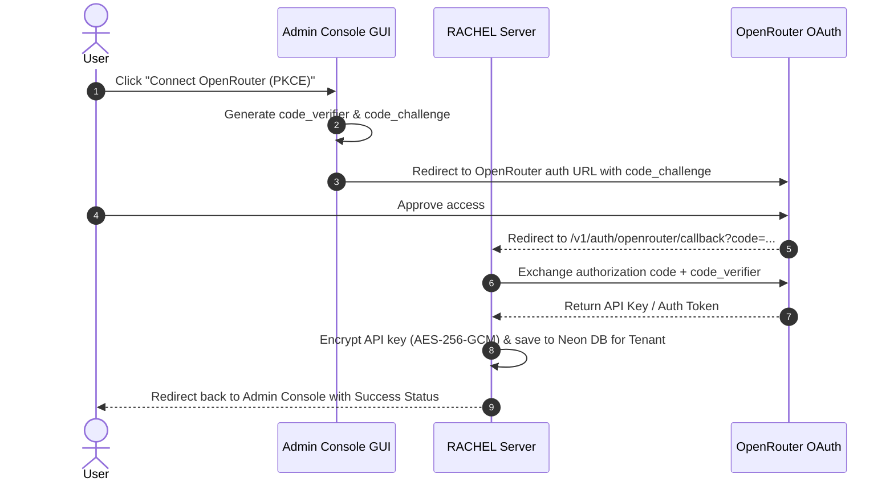

# Road to Multi-Tenant Cloud Deployment

This document outlines the architectural roadmap, design decisions, and implementation plan for enabling **RPG Agent Behind Chat Completion (RACHEL)** to support **multi-tenant cloud service provision** (hosted on **Google Cloud Run** with **Neon PostgreSQL**) for mobile-first, non-technical users alongside its existing **standalone single-tenant execution** on local PCs.

---

## 1. Executive Summary & Core Objectives

RACHEL supports **dual operational modes** to cater to different user profiles:
1. **Multi-Tenant Cloud Service Mode**: Built for **mobile-first, non-technical users** who do not have a PC or cannot run Python applications locally. Enables them to use the proxy via a managed cloud service with simple GUI key management (or resold tokens) and browser-based Admin Console auth.
2. **Standalone Single-Tenant Mode**: Self-hosted local run for users running RACHEL directly on their personal PCs.

### Primary Objectives:
1. **Admin Console Key Management & OAuth PKCE**: Replace mandatory environment variable setups (`OPENROUTER_API_KEY`) with an in-dashboard Admin Console GUI. Support OpenRouter OAuth PKCE authentication alongside direct API keys (BYOK) for OpenAI, Google Gemini, and DeepSeek in both local and multi-tenant modes.
2. **Multi-Tenant Service Provisioning**: In multi-tenant cloud mode, support three key management models:
   - **OpenRouter OAuth PKCE**
   - **Bring Your Own Key (BYOK)** for OpenAI, Google Gemini, DeepSeek, or OpenRouter Bearer Tokens
   - **Resold Tokens / Managed Access** via OpenRouter Provisioned Key Generation
3. **Flexible Storage & Infrastructure**: Enable RACHEL to seamlessly switch between local storage (`file` / local SQLite) for single-tenant desktop use and **Neon PostgreSQL** for multi-tenant **GCP Cloud Run** deployments.

---

## 2. System Architecture & Component Design

### 2.1 Dual-Mode Operation & Tenant Authentication Model

RACHEL supports two runtime operational modes determined by configuration (`MULTI_TENANT_MODE=true|false`):

#### Mode Comparison Matrix

| Feature | Standalone Single-Tenant Mode (Local PC) | Multi-Tenant Cloud Mode (GCP Cloud Run + Neon) |
| :--- | :--- | :--- |
| **Primary Audience** | Tech-savvy users running locally on personal PCs | **Mobile-first non-tech users** (no PC / can't run Python) & service providers |
| **Admin Auth** | Local Proxy Key (`RACHEL_PROXY_KEY`) | Stateless JWT Validation via external Auth provider (Clerk, Auth0, etc.) |
| **API Auth (`/v1/chat/completions`)** | Local Proxy Key (`Authorization: Bearer <key>`) | Tenant Proxy Keys (`sk-tenant-...`) managed in Admin Console |
| **State Storage Engine** | Local files (`data/states`) or SQLite | **Neon PostgreSQL** indexed by `tenant_id` |
| **Credentials Vault** | Encrypted local file (`proxy.key`) / `.env` | AES-256-GCM encrypted in Neon DB via GCP Secret Manager master key |

In **Multi-Tenant Cloud Mode**, client account lifecycle (user sign-up, user profiles, identity management) is handled outside this repository by an external Auth platform (e.g., Clerk, Auth0, Supabase Auth, Firebase Auth).

---

### 2.2 LLM Credentials Vault & Active Provider Selection

The Admin Console GUI key management and Active Provider selection apply universally to **both Local Standalone Mode and Multi-Tenant Cloud Mode**.

#### A. Universal Active Provider Selection (KISS Principle)
Users select **one Active Provider** in their Admin Console GUI from the available options:
1. **OpenRouter (BYOK Bearer Token)**
2. **OpenRouter (PKCE OAuth)**
3. **OpenRouter (Resold Token / Managed Provisioned Key)** *(Cloud Mode only)*
4. **OpenAI (BYOK API Key)**
5. **Google Gemini (BYOK API Key)**
6. **DeepSeek (BYOK API Key)**

When `/v1/chat/completions` is invoked, RACHEL forwards the incoming `model` parameter directly to the user's selected **Active Provider**.

#### B. Storage & Encryption Model by Mode
- **Local Standalone Mode**: Credentials (API keys, PKCE tokens) configured via the Admin Console GUI are stored locally in an encrypted file (`proxy.key`) or local SQLite database.
- **Multi-Tenant Cloud Mode (Tenant-Derived Envelope Encryption)**:
  To prevent service provider admins or DB leaks from exposing raw user keys in bulk, credentials in Neon PostgreSQL are encrypted using **AES-256-GCM Envelope Encryption (DEK/KEK)** with key derivation via **HKDF-SHA256**:
  $$\text{KEK} = \text{HKDF-SHA256}(\text{MasterSecret}, \text{salt}=\text{tenant\_id}, \text{info}=\text{SSO\_sub})$$
  - **Immutable Identity Guarantee**: In OpenID Connect (OIDC / OAuth2 with Google, Facebook, Discord, etc.), the `sub` (subject) claim is **globally unique and immutable** for a user account forever. Therefore, **decryption remains 100% valid across log-offs, log-ins, session expirations, and device switches**.
  - **Admin Console Access**: When a user logs in from any browser or device, RACHEL validates their SSO JWT, reconstructs the KEK from `(MasterSecret + tenant_id + SSO_sub)`, and unwraps the tenant's Data Encryption Key (DEK).
  - **API Execution (`/v1/chat/completions`)**: Incoming `sk-tenant-...` Tenant Proxy Keys securely unwrap the DEK in memory for that request cycle.
  - **Zero-Bulk-Exposure Guarantee**: A database dump alone, even if combined with the server's `ENCRYPTION_MASTER_KEY`, cannot decrypt tenant credentials without active user JWT tokens or valid tenant proxy keys.

---

### 2.3 OpenRouter PKCE OAuth Integration

OpenRouter PKCE (Proof Key for Code Exchange) enables users to authorize RACHEL to access OpenRouter without exposing or manually copying raw API keys.

---

### 2.4 Resold Token / Managed Provisioning Model

For tenants utilizing resold tokens provided by the platform operator:
- RACHEL integrates with **OpenRouter's Management API** to provision individual, restricted API keys per tenant.
- Credit limits, usage quotas, and rate limits are offloaded directly to OpenRouter's platform infrastructure.
- Admin Console displays current provisioned key quota and usage status.

---

### 2.5 Unified SQL Schema & Denormalized LRU Turn Performance

RACHEL implements a **Unified Relational SQL Strategy** across both **Local Standalone Mode (SQLite)** and **Multi-Tenant Cloud Mode (Neon PostgreSQL)** using an identical database schema. In Local Mode, `tenant_id` is fixed to `'local'`.

#### Core Data Entities:
- `tenants`: Primary tenant record linked to external `external_user_id` / `sub` (or `'local'`).
- `tenant_api_keys`: Hashed proxy keys (`sk-tenant-...`) issued to third-party clients (JanitorAI, SillyTavern, etc.).
- `tenant_credentials`: Encrypted LLM provider API keys and PKCE tokens per tenant.
- `tenant_settings`: Active provider selection, default model overrides, and reasoning payload format options.
- `sessions`: RPG session metadata and turn history stored as a denormalized JSON blob (`turns_data` dictionary `{ "<turn_key>": { "before": ..., "after": ... } }`), scoped by `(tenant_id, session_id)`.

Schema migrations are managed **manually** via SQL scripts or Neon SQL Console.

#### LRU Eviction Performance Mitigation Strategy

By storing `turns_data` as a denormalized JSON blob directly inside the `sessions` table (matching the structure of `FileSessionStorage`), RACHEL **completely eliminates SQL sorting operations and subquery deletion overhead**:

| Mitigation Aspect | Standalone Mode (SQLite) & Multi-Tenant Mode (Neon PostgreSQL) |
| :--- | :--- |
| **1. Zero-Sort In-Memory LRU Eviction** | LRU trimming occurs **100% in Python memory** (`dict` / `OrderedDict` key popping when `len > num_states_to_track`) before writing to the database. Eliminates `ORDER BY accessed_at`, CTEs, and `DELETE` queries. |
| **2. Single-Query Network RTT** | Every turn update is a single SQL `UPSERT` (1 network round-trip in Neon Postgres), maximizing serverless response speeds. |
| **3. Minimal Index Maintenance** | Only the primary key index on `(tenant_id, session_id)` is maintained, avoiding multi-column index overhead on secondary tables. |
| **4. Direct Compatibility with `FileSessionStorage`** | 1-to-1 data structure match with existing `.json` files, simplifying data import/export between local disk and cloud databases. |

---

## 3. Brainstorming & Discarded Ideas Log

During architectural design, several alternatives were evaluated and intentionally discarded:

| Evaluated Concept | Status | Reason for Discarding |
| :--- | :--- | :--- |
| **Header Pass-Through for BYOK** (`X-OpenAI-Key`) | ❌ **Discarded** | Forces end-users to input raw LLM keys into third-party clients (e.g. JanitorAI) on every request, defeating Admin Console central key management. |
| **Strict Model-Prefix Routing** (`openai/gpt-4o`, `gemini/gemini-2.5-flash`) | ❌ **Discarded** | Overcomplicates model parameters and breaks standard client presets. Replaced by the simpler **Active Provider Toggle** (KISS principle). |
| **Custom In-House Token Metering Ledger** | ❌ **Discarded** | Calculating token costs and managing atomic USD balance deductions in DB adds significant complexity and race conditions. Replaced by **OpenRouter Provisioned Key Generation** which delegates quota enforcement directly to OpenRouter. |
| **PostgreSQL Row-Level Security (RLS)** | ❌ **Discarded** | Adds session variable configuration overhead per connection in serverless pooled environments (PgBouncer/Cloud Run). `tenant_id` indexed queries provide equivalent isolation with lower latency. |
| **Schema-per-Tenant DB Provisioning** | ❌ **Discarded** | High DDL maintenance overhead and slow schema migrations across hundreds of tenant schemas in Neon PostgreSQL. |
| **Automated Startup DB Migrations** | ❌ **Discarded** | Running migrations on container startup in Cloud Run creates race conditions when multiple container instances scale out simultaneously. Manual schema management selected instead. |

---

## 4. Phased Implementation Plan

### Phase 0: Standalone Portable Python & Lightweight Launchers (Desktop Single-Tenant Packaging)
- [ ] **Portable Python Bundling (`python-build-standalone`)**: Set up build scripts to bundle self-contained, isolated Python runtimes for Windows (`x86_64`), macOS (`aarch64`/`x86_64`), and Linux (`x86_64`).
- [ ] **OS-Specific One-Click Launchers**: Create background launcher scripts/wrappers:
  - **Windows**: Silent `.vbs` launcher (`launch.vbs`) to start Uvicorn without a CMD prompt box and open default browser.
  - **macOS**: Shell launcher (`launch.command`) with double-click execution support.
  - **Linux**: Desktop entry (`rpg-agent.desktop`) and `launch.sh`.
- [ ] **Automated Multi-OS GitHub Release Workflow**: Create a GitHub Actions CI workflow to build and attach `rpg-agent-vX.X.X-{win,mac,linux}.zip` release artifacts on tag push.
- [ ] **Single-Tenant Documentation**: Document local double-click installation and macOS Gatekeeper bypass instructions in `README.md`.

### Phase 1: Multi-Provider LLM Dispatcher & Active Provider GUI (Universal Core)
- [ ] **Multi-Provider Client Layer**: Extend LLM invocation in `src/rachel/agent/` to support direct API calls for OpenAI (`api.openai.com`), Google Gemini (`generativelanguage.googleapis.com`), and DeepSeek (`api.deepseek.com`) alongside OpenRouter.
- [ ] **Active Provider Config**: Implement the **Active Provider Selection** configuration model in `src/rachel/config.py`.
- [ ] **OpenRouter PKCE OAuth Flow**: Implement `/v1/auth/openrouter/authorize` (PKCE challenge generation) and `/v1/auth/openrouter/callback` token exchange in `src/rachel/routes/system.py`.
- [ ] **Admin Console UI Update**: Update `src/rachel/templates/index.html` with a **Provider Credentials** configuration card and an **Active Provider Selector** toggle.

### Phase 2: Unified SQL Storage Engine (SQLite Local + Neon PostgreSQL)
- [ ] **Unified Database Layer (`src/rachel/core/db.py`)**: Define SQLAlchemy/SQLModel models for `tenants`, `tenant_api_keys`, `tenant_credentials`, `tenant_settings`, and `sessions` (including `turns_data` JSON blob).
- [ ] **Unified Relational Storage Strategy (`RelationalSessionStorage`)**: Refactor `BaseSessionStorage` in `src/rachel/core/state.py` to use `RelationalSessionStorage`. Connects to `sqlite:///data/rpg_agent.sqlite3` in Local Standalone Mode (`tenant_id = 'local'`) and Neon PostgreSQL in Multi-Tenant Cloud Mode.
- [ ] **In-Memory Python LRU Eviction**: Implement Python `dict` key popping (`len > num_states_to_track`) before SQL `UPSERT` execution.

### Phase 3: Multi-Tenant Identity, Proxy Keys & Envelope Encryption (Cloud Mode)
- [ ] **Stateless JWT SSO Auth Middleware**: Add JWKS-based JWT validation dependency in `src/rachel/auth.py` for Admin Console routes when `MULTI_TENANT_MODE=true`.
- [ ] **Tenant Proxy Key (`sk-tenant-...`) Management**: Add API endpoints to generate, list, and revoke proxy keys in `src/rachel/routes/system.py`.
- [ ] **Proxy Key Validation**: Update `completions.py` authentication dependency (`require_proxy_key`) to validate `sk-tenant-...` against `tenant_api_keys` and bind `tenant_id` to request context.
- [ ] **Tenant-Derived Envelope Encryption (DEK/KEK)**: Implement HKDF key derivation: $\text{KEK} = \text{HKDF-SHA256}(\text{MasterSecret}, \text{salt}=\text{tenant\_id}, \text{info}=\text{SSO\_sub})$. Admin Console unwraps DEK using SSO `sub`; API calls unwrap DEK in memory using `sk-tenant-...`.

### Phase 4: OpenRouter Resold Token Provisioning & GCP Cloud Run Deployment
- [ ] **OpenRouter Provisioned Key Client**: Implement OpenRouter Management API integration to request provisioned keys for tenants selecting "OpenRouter (Resold Token)" mode.
- [ ] **GCP Cloud Run Production Hardening**: Add GCP Secret Manager environment variable injection documentation (`DATABASE_URL`, `ENCRYPTION_MASTER_KEY`).
- [ ] **Dockerfile Optimization**: Optimize `Dockerfile` for Cloud Run (multi-stage build, non-root user).
- [ ] **Manual Database Migration Scripts**: Write `schema_v1.sql` for initial Neon PostgreSQL database provisioning.

---

*Document finalized based on design alignment.*
