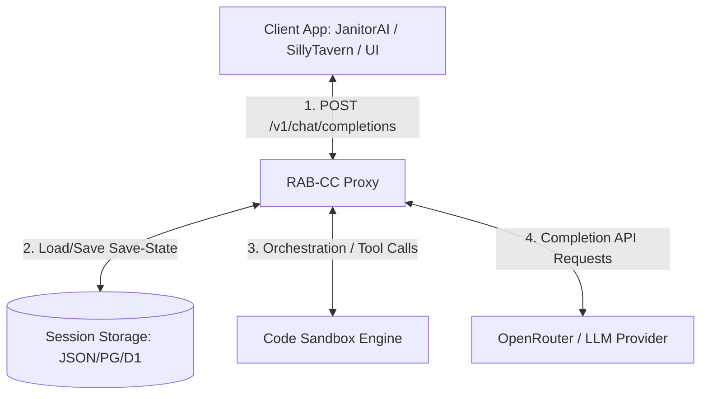
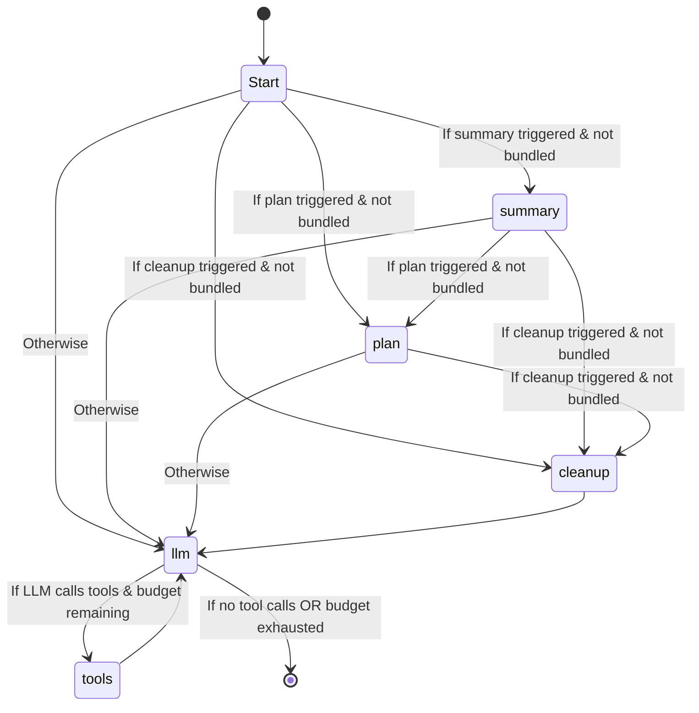

# RPG Agent Behind Chat Completion (RAB-CC)
## Comprehensive Technical & Non-Technical Specifications

This document defines the reverse-engineered requirements and specifications for the **RPG Agent Behind Chat Completion (RAB-CC)** repository. It serves as a standalone reference manual for re-developing the proxy service and its front-end interface in pure TypeScript/JavaScript across three delivery targets:
1. **GitHub Pages** (Client-side, browser-only application)
2. **Electron App** (Desktop application for Windows and Linux)
3. **Cloudflare Workers + D1** (Edge computing backend with serverless database storage, operating as a token-reselling business)

---

## 1. Introduction & Non-Technical Specifications

### 1.1 The Core Problem
When Large Language Models (LLMs) act as Game Masters (GMs) or narrator agents in Text-based Role-Playing Games (RPGs), they suffer from major limitations:
*   **Dice Rolling Hallucinations:** LLMs predict text based on probability. When asked to roll a d20, they tend to select numbers that fit a pleasant story narrative (often fudging rolls) rather than generating truly random numbers.
*   **Mathematical Errors:** LLMs are bad at math. They struggle to calculate combat modifiers, track health points (HP), deduct gold, or monitor inventory weight correctly over multiple turns.
*   **Memory Decay & Context Blowup:** As a conversation grows, the LLM forgets character sheets, inventory items, and quest state. Attempts to feed the entire history into the prompt quickly exhausts the context window.
*   **State Drift & Branching:** In modern chat interfaces (e.g., JanitorAI, SillyTavern), users can **retry** an AI response (swipe) or **edit** a past message. In a standard setup, a retry or edit makes it impossible to know which action to rollback, resulting in double-counting damage, lost items, or state corruption.

### 1.2 The RAB-CC Solution
RAB-CC acts as a stateful proxy between the front-end chat client and the LLM completion provider (like OpenRouter). It intercepts completion requests to:
1.  **Resolve the active session** and load the exact save-state for the current conversation branch.
2.  **Run an orchestrator loop** that triggers sub-agents to update story plans, summarize narrative context, and run a sandbox to safely update numeric variables.
3.  **Provide programmatic tools** (RNG, dice, and sandboxed code execution) so the LLM can execute calculations deterministically.
4.  **Inject the updated game state** back into the system instructions, ensuring the LLM always has the correct data.

---

## 2. Architecture & Data Flow

### 2.1 System Architecture Overview



### 2.2 The 4-Element State Structure
Every session save-state is divided into four distinct components. Keeping these separated ensures the agent can read and write state without cluttering system instructions:

| Component | Target Use Case | Format | Mutability |
| :--- | :--- | :--- | :--- |
| **`state`** | Publicly trackable metrics (e.g., HP, Gold, inventory items, attributes, location). | JSON Object | Read/Write by LLM via Sandbox |
| **`plan`** | Narrative checklist (e.g., active quest goals, upcoming NPC plans, story milestones). | JSON Array of Objects | Read/Write by LLM via tool or planning node |
| **`summary`** | A rolling narrative summary of the story events so far. | Text / String | Appended to periodically or via tool |
| **`hidden_state`** | Secret parameters hidden from the player but visible to the LLM (e.g., enemy HP, trap locations, status effect durations, internal turn counters). | JSON Object | Read/Write by LLM via Sandbox |

### 2.3 Session ID Resolution Hierarchy
When a request is received, the proxy must identify the session. It resolves the `session_id` using a 3-level fallback hierarchy:

```
                  Incoming Request Payload
                             │
                             ▼
            ┌──────────────────────────────────┐
            │ 1. Explicit Session ID?          │──► Yes ──► [Use URL/Query Param]
            │    (URL path or query parameter) │
            └──────────────────────────────────┘
                             │ No
                             ▼
            ┌──────────────────────────────────┐
            │ 2. OOC (Out-Of-Character) Tag?   │──► Yes ──► [Use Tag Name]
            │    (Scan history for [session:X])│
            └──────────────────────────────────┘
                             │ No
                             ▼
            ┌──────────────────────────────────┐
            │ 3. Suffix Hash + Username?       │──► Yes ──► [Use Combined ID]
            │    (MD5 of System Prompt suffix  │
            │     + Username from last message)│
            └──────────────────────────────────┘
                             │ No
                             ▼
                 [Fallback: "unknown-session"]
```

1.  **Level 1: Explicit Session ID (Highest Priority):**
    *   Path: `POST /v1/{session_id}/chat/completions`
    *   Query Parameter: `POST /v1/chat/completions?session_id={session_id}`
2.  **Level 2: OOC Tag (Medium Priority):**
    *   Scans messages in the payload from **newest to oldest** for the pattern: `[session:\s*([a-zA-Z0-9_\-]+)]` (case-insensitive).
    *   The matching group becomes the `session_id`.
3.  **Level 3: Suffix Hash + Username (Lowest Priority / Fallback):**
    *   Creates a stable session key unique to the specific user and character card.
    *   **Suffix Hash:** Extracts the last 300 characters of the `system` message content, strips whitespace, and computes its MD5 hash (first 16 characters).
    *   **Username:** Extracts the speaker prefix of the last `user` message (e.g. if the message is `"Shan Yu: I draw my sword"`, the username is `"Shan Yu"`). The prefix is matched using the pattern: `^([^:\n]{1,64}):\s` on the first line.
    *   The resulting session ID is: `{suffix_hash}__{username}`.

### 2.4 Turn Key Cryptographic Isolation
To handle swiping (retrying) and past-message editing without state corruption, the proxy utilizes a **Turn Key**:

$$\text{turn\_key} = \text{SHA-256}[:24]\big(\text{session\_id} + \text{"\textbackslash 0"} + \text{last\_user\_message} + \text{"\textbackslash 0"} + \text{penultimate\_assistant\_message}\big)$$

*   **Before State Rehydration:** Before running the orchestration graph for a turn, the proxy looks up the `prev_turn_key` (which is extracted from the last assistant message's annotation block). It fetches the `after` state of that previous turn. If the turn is a cache miss (e.g., past history was cleared or edited), it falls back to an empty state or a best-effort rebuild.
*   **State Commit:** Once the turn is complete, the resulting `after` state is saved under the current turn's `turn_key`.
*   **Message Annotation:** To pass the turn metadata back to the client (so that subsequent requests carry it in the message history), the proxy prepends a plain-text annotation block to the assistant's response:
    ```text
    [proxy: session={session_id} turn={turn_key}]

    {actual assistant response text}
    ```
*   **Annotation Stripping:** When receiving messages from the client, the proxy **must** strip these `[proxy: ...]` annotation blocks from all message contents before sending them to the LLM. This prevents the LLM from hallucinating or echoing the proxy metadata back in its responses.

---

## 3. Agent Execution Graph

Rather than executing a single completion call, the proxy uses a node-based state machine (similar to LangGraph) to process each turn.

### 3.1 Graph Flow Control



*   **Recursion Limit (Budget):** The loop is capped at a maximum iteration count (typically `max_iterations = 5` or `6`). Each visit to the `llm` node increases the counter. If the limit is hit, no further tool calls are allowed, forcing a final assistant response.

### 3.2 Trigger Types
The secondary nodes (`summary`, `plan`, `cleanup`) run based on configuration:
1.  **Periodic:** Fires every $N$ turns (e.g., plan every 10 turns, summary every 10 turns with a turn offset/gap to prevent simultaneous LLM calls).
2.  **Probabilistic:** Fires randomly based on a probability threshold $P$ (e.g., $P=0.10$ for a 10% chance per turn). The random seed is derived deterministically by hashing the concatenation of all message contents to ensure retries of the same turn yield the same trigger decision.
3.  **Disabled:** The node never runs.

### 3.3 LLM Bundling
*   **Bundled (`bundle_llm: true`):** The summary, plan, or cleanup task is appended as an instruction inside the main roleplay system prompt. The LLM is expected to run these tasks using tools (`append_summary`, `update_plan`, `execute_code_sandbox`) during the main roleplay call. This saves API costs and latency.
*   **Standalone (`bundle_llm: false`):** The proxy fires separate independent LLM calls to process the plan, summary, or cleanup *before* invoking the main roleplay LLM.

---

## 4. Sandbox Execution Engine

The sandbox executes code blocks generated by the LLM to safely read and write the Numeric game metrics (`state` and `hidden_state`).

### 4.1 Input & Variables Exposure
*   The sandbox receives the `state` object (and `hidden_state` if utilizing the 4-element structure).
*   In the Javascript sandbox, the code can read/write properties directly on the global `state` and `hidden_state` objects.
*   Standard console methods like `console.log` are intercepted and returned as output.
*   Code execution must not re-declare `state` or `hidden_state` (e.g., no `let state = ...`), and should not use `return` statements.

### 4.2 State Guardrails & Cleanliness Constraints
To prevent state objects from growing indefinitely, leaking story logs, or exhausting memory, the following limits must be validated post-execution:
1.  **Nesting Depth:** Maximum depth of nested objects/arrays (default: `max_depth = 4`).
2.  **Width Limit:** Maximum number of keys in any object, or elements in any array (default: `max_width = 32`).
3.  **String Length:** Maximum length of any string value (default: `max_string_length = 80`). This prevents the LLM from writing long text logs/history inside the numerical state.

### 4.3 Rollback Mechanism
If the sandbox execution fails (syntax error, infinite loop, timeout, or validation constraint violation), the proxy must discard all modifications and restore the pre-execution copy of the state, returning the error details to the LLM as a tool result.

---

## 5. Prompts & LLM Orchestration

### 5.1 Dynamic System Prompt Assembly
The system instruction sent to the LLM is assembled dynamically on every call. It contains:
1.  **The Active Task List:** Instructions on what tasks must be performed (e.g. "Task 1: Call `update_plan`...", "Task 2: Progress the story...").
2.  **Current Variables Block:** The serialized JSON representations of the active `state`, `hidden_state`, `summary`, and `plan`.
3.  **Roleplay & Secrecy Guidelines:** Instructions to hide `hidden_state` metrics, write organic narrative, and stay in character.
4.  **Sandbox Syntax & Constraints Rules:** Concrete syntax rules (V8 or Python) and state limits.
5.  **Remaining Budget Notice:** Alerting the LLM of its remaining tool-calling iterations.

### 5.2 Deep-Reasoning Format Translation
To leverage models that output structured thinking (e.g., DeepSeek-R1, Gemini 2.0/3.5, Anthropic Thinking), the proxy must support capturing the model's reasoning/thinking block. The proxy parses this thinking content, separates it from the final text, and forwards it to the client.

The proxy configures reasoning options by injecting the specific format extension required by the target API provider:
*   **OpenRouter:** `{ "extra_body": { "include_reasoning": true } }`
*   **OpenAI:** `{ "reasoning_effort": "medium" }`
*   **Gemini:** `{ "extra_body": { "thinking_config": { "thinking_budget": -1 } } }`
*   **Anthropic:** `{ "thinking": { "type": "enabled", "budget_tokens": 1024 } }`
*   **DeepSeek:** `{ "extra_body": { "thinking": { "type": "enabled" } } }`

---

## 6. API Endpoint Details

### 6.1 Completions API
*   **Endpoint:** `POST /v1/chat/completions` or `POST /v1/{session_id}/chat/completions`
*   **Authentication:** `Authorization: Bearer <RPG_AGENT_PROXY_KEY>` header.
*   **JSON Response:** Returns standard OpenAI-compatible chat completion payload.
*   **SSE Streaming Response:** Returns Server-Sent Events with data chunks. The proxy **must** stream the `[proxy: ...]` annotation block as the first chunk before streaming the actual model outputs.

### 6.2 Admin CRUD API
All admin endpoints require `Authorization: Bearer <RPG_AGENT_PROXY_KEY>` header.

#### 1. List Sessions
*   **Method/Path:** `GET /v1/sessions`
*   **Response:** `{ "sessions": ["id1", "id2"], "count": 2 }`

#### 2. Get Session Details
*   **Method/Path:** `GET /v1/sessions/{session_id}`
*   **Response:** Returns the current state along with a detailed turn-by-turn history showing the before and after states for every turn key.

#### 3. Reset Session
*   **Method/Path:** `POST /v1/sessions/{session_id}/reset`
*   **Description:** Wipes the turn history of a session while keeping the session file intact.

#### 4. Delete Session
*   **Method/Path:** `DELETE /v1/sessions/{session_id}`
*   **Description:** Deletes the session data from disk entirely.

#### 5. Export Session
*   **Method/Path:** `GET /v1/sessions/{session_id}/export`
*   **Description:** Returns the raw internal dictionary of all turns.

#### 6. Import Session
*   **Method/Path:** `POST /v1/sessions/{session_id}/import`
*   **Body:** Raw turn dictionary.
*   **Description:** Validates structure, normalizes elements, and saves imported history.

#### 7. Get Status
*   **Method/Path:** `GET /v1/status`
*   **Response:** Configuration metrics and diagnostics for the dashboard SPA.

---

## 7. Single Page Application (SPA) Dashboard

The proxy serves an administrative Single Page Application from the root URL (`/`). It includes:
*   **Authentication Portal:** Prompts for the `RPG_AGENT_PROXY_KEY` and persists it in `localStorage`.
*   **Interactive Sidebar:** Lists active sessions, allows refreshing the list, and supports importing new session JSON files.
*   **Credentials Copy Helper:** Displays the API URL and the proxy key (masked with a toggle to reveal) with one-click copy buttons.
*   **Diagnostics Panel:** Displays system stats (sandbox timeout, active session count, storage engine).
*   **Interactive Session Inspector:**
    *   Displays the current state JSON.
    *   Displays an expandable list of past turns.
    *   Provides side-by-side comparative views of the before/after state changes for each turn.
    *   Exposes buttons to Reset, Delete, or Export the active session.

---

## 8. TypeScript Rewrite & Delivery Targets

### 8.1 TypeScript Equivalents for Core Python Stack
*   **FastAPI / Routing:** Can be replaced with **Express**, **Koa**, **Fastify**, or native **Hono** (highly recommended for edge workers and pages).
*   **LangGraph / LangChain:** Can be replaced with **LangChain.js** / **LangGraph.js**, or a simple custom state-machine loop since the execution logic follows a predictable flowchart.
*   **V8 Sandbox (MiniRacer):** Can be run using native Node.js isolated VMs (`vm` or `isolated-vm` libraries).

---

### 8.2 Delivery Target 1: GitHub Pages (Browser-Only)
In this mode, everything runs directly inside the user's web browser with zero server-side components.

```
┌────────────────────────────────────────────────────────┐
│                      Web Browser                       │
│ ┌────────────────────────────────────────────────────┐ │
│ │                  GitHub Pages UI                   │ │
│ └────────────────────────────────────────────────────┘ │
│                            │                           │
│                            ▼                           │
│ ┌────────────────────────────────────────────────────┐ │
│ │             Browser-Side Orchestration             │ │
│ └────────────────────────────────────────────────────┘ │
│          │                           │                 │
│          ▼                           ▼                 │
│ ┌──────────────────┐       ┌────────────────────┐      │
│ │ Storage:         │       │ Sandbox:           │      │
│ │ IndexedDB        │       │ Web Worker/iframe  │      │
│ └──────────────────┘       └────────────────────┘      │
└──────────┼─────────────────────────────────────────────┘
           │
           ▼ (HTTPS / PKCE)
 ┌───────────────────┐
 │   OpenRouter API  │
 └───────────────────┘
```

#### Specifications:
1.  **Architecture:** A static single-page application built using HTML/CSS/TS, compiled to static assets, and hosted on GitHub Pages.
2.  **Storage Engine:** Replaces file-backed storage with browser-native **IndexedDB** (using libraries like `localforage` or `idb`) or **LocalStorage** for state persistence.
3.  **Sandbox Engine:** Runs JavaScript code snippets inside a web worker or a hidden, sandboxed `<iframe>` with the script execution restricted (`sandbox="allow-scripts"`). Communication is done via `postMessage`. This isolates the execution context from the main application thread.
4.  **API Connection & PKCE:**
    *   Since there is no backend server to secure an API key, the app must implement **PKCE (Proof Key for Code Exchange) OAuth** flows directly in the browser to authenticate with OpenRouter or other common providers.
    *   Access tokens are stored securely in memory or `sessionStorage` and used directly to make HTTPS requests to the completion endpoints.

---

### 8.3 Delivery Target 2: Electron App (Desktop)
This mode packages the application into a standalone desktop installer for Windows and Linux.

```
┌────────────────────────────────────────────────────────┐
│                   Electron Container                   │
│                                                        │
│  ┌─────────────────┐           ┌───────────────────┐   │
│  │ Render Process  │ ◄───────► │   Main Process    │   │
│  │ (Chromium UI)   │    IPC    │ (Node.js Backend) │   │
│  └─────────────────┘           └───────────────────┘   │
│                                          │             │
│                                          ▼             │
│                                ┌───────────────────┐   │
│                                │ SQLite / Local FS │   │
│                                └───────────────────┘   │
│                                          │             │
│                                          ▼             │
│                                ┌───────────────────┐   │
│                                │   Node.js VM      │   │
│                                └───────────────────┘   │
└──────────────────────────────────────────┼─────────────┘
                                           │
                                           ▼ (HTTPS)
                                 ┌───────────────────┐
                                 │  OpenRouter API   │
                                 └───────────────────┘
```

#### Specifications:
1.  **Architecture:** An Electron wrapper with a Chromium-based Render Process (frontend UI) communicating via Inter-Process Communication (IPC) to a Node.js Main Process (backend server logic).
2.  **Storage Engine:** Persists states to the local filesystem as JSON files in the user's Application Data directory (`app.getPath('userData')`), or utilizes a local **SQLite** database.
3.  **Sandbox Engine:** Executes code using Node.js's built-in **`vm`** module inside a restricted context, or using a dedicated library like **`isolated-vm`** to run scripts in separate V8 isolates with memory limits and execution timeouts.
4.  **Network Requests:** The Main Process handles all API requests to OpenRouter. The user can supply their own API keys via the UI, which are stored locally in the OS key-store using Electron's `safeStorage` API.

---

### 8.4 Delivery Target 3: Cloudflare Workers + D1 Storage (Edge hosted Token Reseller)
This mode runs the application as a scalable API gateway on Cloudflare's serverless edge networks, acting as a token-reselling business.

```
                      Client UI Request
                              │
                              ▼
┌────────────────────────────────────────────────────────┐
│                   Cloudflare Worker                    │
│                                                        │
│  ┌───────────────────┐          ┌───────────────────┐  │
│  │  OAuth Middleware │ ───────► │  Token Account/   │  │
│  │   & Key Validator │          │  Reseller Manager │  │
│  └───────────────────┘          └───────────────────┘  │
│            │                              │            │
│            ▼                              ▼            │
│  ┌───────────────────┐          ┌───────────────────┐  │
│  │    Edge Graph     │ ◄──────► │     D1 Storage    │  │
│  │    Orchestrator   │          │ (SQL State/Billing│  │
│  └───────────────────┘          └───────────────────┘  │
│            │                              │            │
│            ▼                              ▼            │
│  ┌───────────────────┐          ┌───────────────────┐  │
│  │   QuickJS WASM    │          │ KV Cache Store    │  │
│  │   Code Sandbox    │          │ (Turn validation) │  │
│  └───────────────────┘          └───────────────────┘  │
└────────────┼──────────────────────────────┼────────────┘
             │                              │
             ▼ (Forward Auth)               ▼ (Metered proxy)
     ┌──────────────┐               ┌──────────────┐
     │  OpenRouter  │               │ Stripe / Lats│
     └──────────────┘               └──────────────┘
```

#### Specifications:
1.  **Architecture:** Built using **Hono** framework and deployed as a serverless Cloudflare Worker.
2.  **Storage Engine:** Utilizes **Cloudflare D1**, a serverless SQL database, to store turn history and billing/token balances. Turn key state values are stored as JSON strings in D1 columns.
3.  **Sandbox Engine:** Since Cloudflare Workers run in a shared isolate environment, running arbitrary JavaScript requires compilation to WebAssembly. The sandbox must run inside a **QuickJS WebAssembly** compiler, executing the LLM-generated code in a isolated virtual engine with strict CPU/RAM limits.
4.  **Token Reselling Business Logic:**
    *   **User Registration & Authentication:** Users sign up and obtain a proxy API key via OAuth.
    *   **Usage Metering & Limits:** The worker intercepts `/v1/chat/completions` requests, checks the user's prepaid token balance, and validates request limits.
    *   **API Proxying:** The worker strips client annotations, runs the state machine, calls OpenRouter with the master reseller key, calculates input/output tokens used, deducts credits from the user's D1 balance, and returns the response.
